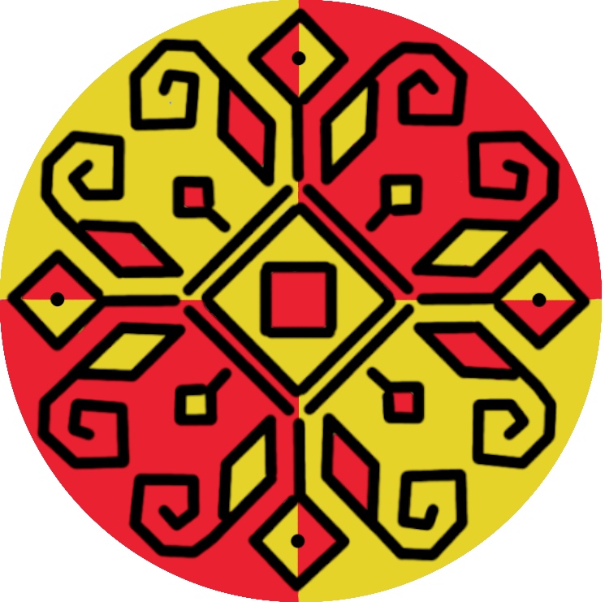

  

<h1 align="center">İAZAR</h1> 

Iazar este un proiect dezvoltat de echipa **İAZARI** în cadrul proiectului de la [TekWill](https://tekwill.md/).
Scopul nostru este să antrenăm un model de transcrierea vocii în text, să transcrie [graiul matern Bricenean](https://ro.wikipedia.org/wiki/Graiul_moldovenesc?lang=ro).

Mai multă descriere a proiectului -> https://yerudit.codeberg.page/blog/ai/

# [iazar-datacollector](https://github.com/Yehoward/iazar-datacollector)

Acesta este strîngătorul de date, cu ajutorul căruia putem strînge date vocale de la donatori pentru antrenarea modelului.

# [iazar-tg-bot](https://github.com/Yehoward/iazar-tg-bot)

Bot telegram pentru transcrierea vocii în text, ce lucrează cu ajutorul modelului antrenat.

# [model_md_coqui](https://github.com/Yehoward/model_md_coqui)

Modelul "antrenat" coqui.

# [whisper-small-ro](https://github.com/Yehoward/whisper-small-ro)

Modelul antrenat whisper.

# Echipa

Diana Josan

Crinela Cernelia

Yehoward Rudenco
